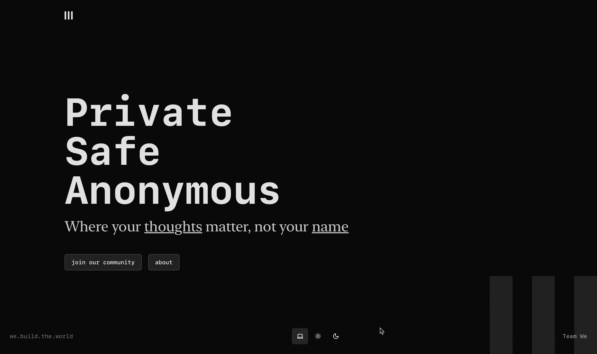

# We

Welcome to the **We - Anonymous Platform for University Students**! This platform provides a safe and secure space for university students to connect and share thoughts anonymously. Built with **Next.js** and **Shadcn**, it offers a clean, modern interface and a seamless user experience. This README will guide you through understanding the project.

---

## Features

- **Anonymous Signup:** Join the platform without revealing your identity.
- **Beta Access Signup:** Collect user signups for the beta program.
- **Modern UI:** Clean and accessible design using ShadCN.
- **Fast and Scalable:** Powered by Next.js for server-side rendering and performance.
- **Responsive Design:** Optimized for all devices, including mobile, tablet, and desktop.

---

## Tech Stack

- **Framework:** [Next.js](https://nextjs.org/) (React-based framework)
- **UI Components:** [ShadCN](https://shadcn.dev/) (a library of beautifully designed components)
- **Styling:** CSS Modules or Tailwind CSS
---

